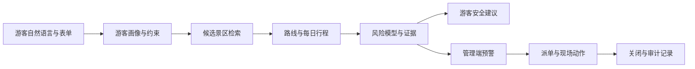
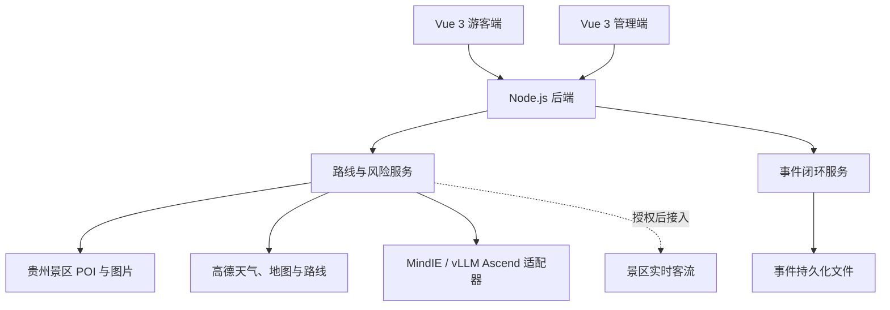

# 黔行守护

贵州山地旅游 AI 伴游与安全预警平台

## 1. 项目简介

黔行守护面向贵州山地旅游场景，将游客自然语言需求、景区点位、城市级天气、路线距离、山地安全规则和应急服务资源组合成可执行行程，并把路线风险同步到景区管理端，形成预警、派单、响应、关闭和复盘闭环。

项目不是普通聊天机器人，也不只是景点推荐页面。系统重点回答四个问题：

1. 游客与谁同行、从哪里出发、计划玩几天、担心什么？
2. 哪条路线更适合当前人群、天气和路线强度？
3. 风险来自哪里，游客应当如何调整？
4. 景区如何接收同一项风险并完成处置？

## 2. 核心场景

示例输入：

> 从遵义出发，带父母和孩子玩 3 天，不想太累，担心下雨路滑，想去黄果树和梵净山。

系统会识别日期、出发城市、游客类型、天数、路线强度、天气担忧和指定目的地，并回填结构化表单。用户可以继续修改，再生成按天组织的路线、地图、风险解释、安全建议和服务点。

## 3. 产品组成

### 游客端

访问：`http://127.0.0.1:5173/`

- 自然语言需求解析与表单双向联动
- 贵州 9 个市州出发枢纽
- 20 个热门目的地入口及全量景区检索
- 1–10 天按日行程生成
- 日期、路线卡片和地图点位联动
- 当日地图自动局部放大
- 景点风险分、证据、建议动作和应急服务点
- 景点图片展示
- 路线结果与管理端共享

### 管理端

访问：`http://127.0.0.1:5173/?mode=demo`

- 查看游客端生成的同一条路线
- 按日期查看路线、点位和风险摘要
- 高风险点位筛选与详情查看
- 责任资源分派和现场动作记录
- 事件状态、备注和审计记录持久化
- 景区资源检索
- 数据接入与系统运行状态查看

## 4. 决策闭环



系统使用同一 `planId` 贯通需求、路线、风险解释、应急覆盖和管理处置，保证卡片、地图、证据和管理事件来自同一份决策快照。

## 5. 技术架构



| 层级 | 技术 |
|---|---|
| 前端 | Vue 3、Vite、ECharts、Lucide Vue |
| 后端 | Node.js 原生 HTTP API |
| 地图与天气 | 高德 Web 服务 API |
| AI 推理适配 | MindIE / vLLM OpenAI 兼容接口 |
| 数据存储 | JSON 数据文件与事件持久化文件 |
| 测试 | Node Test、接口契约测试、浏览器回归脚本 |

## 6. 数据基础与边界

| 数据项 | 当前规模或状态 | 口径 |
|---|---:|---|
| 贵州景区及风景名胜 POI | 2,017 条 | 高德风景名胜检索快照 |
| 具有图片记录的 POI | 1,886 条 | 路线候选优先使用有图点位 |
| 市州覆盖 | 9 个 | 支持主要市州作为出发枢纽 |
| 热门目的地入口 | 20 个 | 可直接选择，也可继续搜索 |
| 节假日公开样本 | 3 条 | 用于规则校准，不代表实时客流 |
| 行程天数 | 1–10 天 | 按天生成并支持日期切换 |

重要边界：

- 2,017 条 POI 不等同于主管部门正式 A 级景区名录。
- 配置高德 Key 后，天气和道路规划使用真实接口。
- 未来日期使用天气预报，不把今天实况冒充未来天气。
- 未获得景区客流授权时，只显示客流压力估算，不显示虚构人数。
- 公共数据目录元数据已接入；正式数据内容仍需赛事账号或授权。
- MindIE/vLLM Ascend 适配器已完成，真实远程算力仍需部署和鉴权。

## 7. 当前能力状态

| 能力 | 状态 | 说明 |
|---|---|---|
| 自然语言游客画像解析 | 已完成 | 支持出发地、日期、天数、人群、天气和目的地 |
| 1–10 天路线生成 | 已完成 | 按天组织并保持地理连续性 |
| 每日地图联动 | 已完成 | 日期、点位、线条和风险摘要同步 |
| 风险解释 | 已完成 | 返回证据、建议动作和应急服务点 |
| 游客端与管理端共享路线 | 已完成 | 使用同一 `planId` |
| 管理事件持久化 | 已完成 | 状态、责任人、动作、备注和审计记录可恢复 |
| 高德天气与路线适配 | 已完成 | 配置 Key 后调用真实接口，失败时诚实降级 |
| 授权客流接口适配 | 已完成适配 | 等待景区正式接口与 Token |
| MindIE/vLLM Ascend 适配 | 已完成适配和契约测试 | 等待远程服务部署、鉴权和性能联调 |
| 公共数据目录代理 | 已完成元数据接入 | 正式数据内容仍需授权 |

## 8. 项目结构

```text
qianzhi-github-repo/
├─ frontend/
│  ├─ src/
│  ├─ tests/
│  └─ package.json
├─ backend/
│  ├─ data/
│  ├─ scripts/
│  ├─ tests/
│  ├─ server.js
│  └─ package.json
├─ docs/
├─ PRODUCT.md
└─ README.md
```

## 9. 本地运行

环境要求：Node.js 20 或更高版本。

启动后端：

```powershell
cd backend
npm install
npm start
```

后端默认地址：`http://127.0.0.1:8093`

健康检查：`http://127.0.0.1:8093/api/health`

启动前端：

```powershell
cd frontend
npm install
npm run dev
```

游客端：`http://127.0.0.1:5173/`  
管理端：`http://127.0.0.1:5173/?mode=demo`

## 10. 环境变量

基于 `backend/.env.example` 创建 `backend/.env`，不要提交真实密钥。

```dotenv
AMAP_WEB_SERVICE_KEY=
AMAP_WEB_SERVICE_SECRET=

CROWD_FLOW_API_URL=
CROWD_FLOW_API_TOKEN=
CROWD_FLOW_PROVIDER=

ASCEND_INFERENCE_URL=
ASCEND_API_KEY=
ASCEND_MODEL=qianxing-guardian
ASCEND_TIMEOUT_MS=20000

INCIDENT_STORE_PATH=
```

## 11. 核心 API

| 方法 | 接口 | 作用 |
|---|---|---|
| GET | `/api/health` | 服务健康状态和当前模式 |
| GET | `/api/integration-status` | 外部服务接入状态 |
| GET | `/api/scenic-spots/summary` | 景区数据统计 |
| GET | `/api/scenic-spots` | 景区检索与筛选 |
| GET | `/api/scenic-photo` | 景区图片代理 |
| GET | `/api/tourism/live-weather` | 城市级实况和预报 |
| GET | `/api/tourism/crowd-flow` | 授权客流或压力估算 |
| GET | `/api/tourism/static-map` | 高德静态地图或降级底图 |
| POST | `/api/tourism/route-plan` | 生成路线、每日行程和决策快照 |
| POST | `/api/tourism/risk-explanation` | 返回风险证据和建议 |
| POST | `/api/tourism/emergency-coverage` | 评估应急服务覆盖 |
| POST | `/api/tourism/data-lineage` | 返回决策数据血缘 |
| GET/POST | `/api/tourism/incidents` | 查询或写入管理事件 |
| GET | `/api/tourism/ascend-readiness` | 昇腾适配状态 |
| GET | `/api/tourism/project-status` | 项目数据和依赖状态 |
| GET/POST | `/api/public-data/catalog` | 公共数据目录代理 |
| POST | `/api/guide-summary` | 生成 AI 决策摘要 |

## 12. 昇腾推理模式

未配置 `ASCEND_INFERENCE_URL` 时，系统使用本地决策服务，核心业务可完整演示。

配置远程地址后，后端按 OpenAI 兼容格式向 MindIE/vLLM 发送请求。适配器支持模型配置、API Key、请求超时、JSON 响应解析、调用状态记录和失败后的本地降级。

真实昇腾服务仍需在试点环境完成部署、鉴权和性能联调。

## 13. 测试

后端测试：

```powershell
cd backend
npm test
```

自然语言解析测试：

```powershell
cd frontend
npm run test:intent
```

生产构建：

```powershell
cd frontend
npm run build
```

浏览器回归：

```powershell
cd frontend
npm run test:e2e
```

当前测试覆盖数据健康、路线天数、不同出发城市、指定景区、风险解释、应急覆盖、事件持久化、昇腾接口契约、意图解析和移动端布局。

## 14. 商业模式

1. 试点与部署：系统初始化、景区数据治理和接口联调，一次性交付。
2. 年度 SaaS 订阅：游客端、管理端、风险规则维护和运维升级。
3. 增值服务：专项活动保障、风险报告、模型定制和跨系统对接。

成熟期目标收入结构为：年度 SaaS 订阅 45%、试点部署与接口 35%、数据与专项增值 20%。该比例为规划目标，不代表已实现营收。

## 15. 四周试点建议

1. 第 1 周：部署、点位梳理、规则与服务资源校准。
2. 第 2 周：小流量游客验证，记录路线采纳和修改原因。
3. 第 3 周：验证预警、派单、响应和关闭。
4. 第 4 周：形成试点评估、接口清单和复制建议。

## 16. 正式上线前仍需完成

- 获得至少一个景区的正式试点授权。
- 接入票务、闸机、摄像头或客流接口。
- 获取正式应急服务点和责任资源名录。
- 部署可访问的 MindIE/vLLM Ascend 推理服务。
- 将事件 JSON 存储升级为正式数据库。
- 增加身份、权限和操作审计。
- 完成隐私、数据安全和等保相关评估。
- 建立监控、日志、备份和故障恢复机制。

## 17. 答辩与宣传口径

- 不把压力估算表述为实时客流人数。
- 不把目录元数据表述为已经获得全部公共数据。
- 不把适配器完成表述为远程昇腾算力已正式部署。
- 不把 2,017 条 POI 表述为贵州全部 A 级景区。
- 不把商业规划比例表述为已实现营收。
